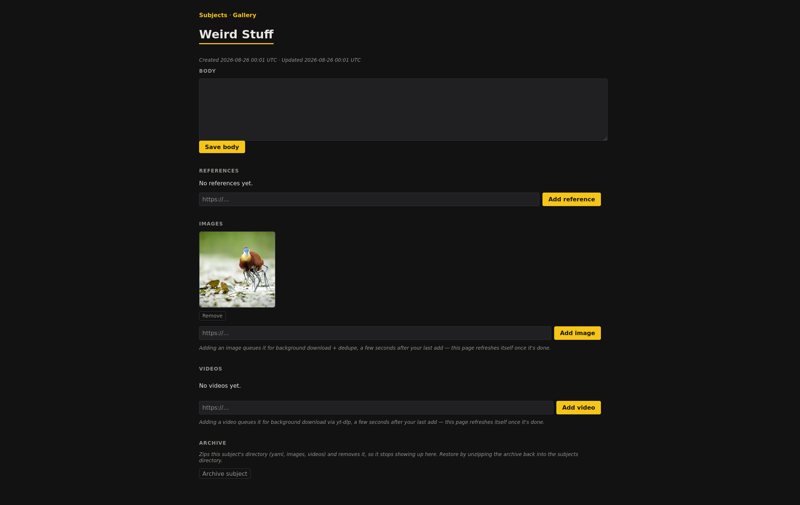

# Curio

A small tool for gathering reference images / videos for creative projects. Its pretty general-purpose, but I use it for:

- Inspiration for painting Warhammer
- Reference images for D&D, especially via virtual tabletops

## Structure

- The tool works on a directory (defaults to `./subjects`), within which is a directory per "subject"
- Each subject is a grouping of images, it has a name, description, and a list of images / videos
- The database is the files on-disk, there's no structured metadata database to worry about

## Running

- Either via a web UI - (`uv run server.py` serves on `http://127.0.0.1:8000`), or a script that downloads / dedupes (`uv run sync.py`, or `./run.sh`)
- The dockerised version is the server
- The subjects directory is picked with the `SUBJECTS_DIR` environment variable
